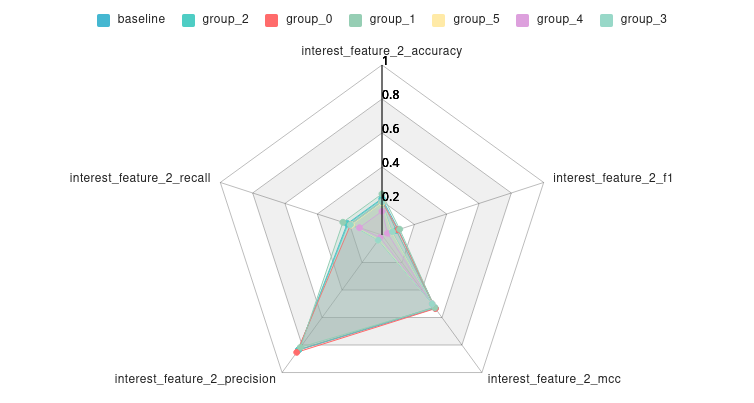

# Fairness Awareness

A Python plugin for ML model fairness evaluation for classification. Built on the [aisc-plugin-interface](https://github.com/lux-ai-factory/aisc-plugin-interface) framework.

## Features

- **Classification Fairness**: Compares model performance across different selected categories of specified interest feature
- **Multiple input formats**: CSV and Parquet datasets, ONNX models



## Installation

```bash
uv sync
```

## Development

### Project Structure

```
src/fairness_awareness/
├── __init__.py                    # Public exports
├── data_input_provider.py         # CSV/Parquet data reader
├── model_input_provider.py        # ONNX model wrapper
├── utils.py                       # Shared utilities
└── classification/
    ├── config_form.py             # Pydantic config + UI schema
    ├── base_plugin.py             # Abstract base class
    └── plugin.py                  # ClassificationFairnessPlugin
```

### Use

Features must follow the following types:
- A date feature is optional but not required, not used in the attack, and must be of type DATE.
- A target feature must be specified and of type INTEGER. Only classification is supported.
- Input features cannot be of type CATEGORICAL nor DATE.
